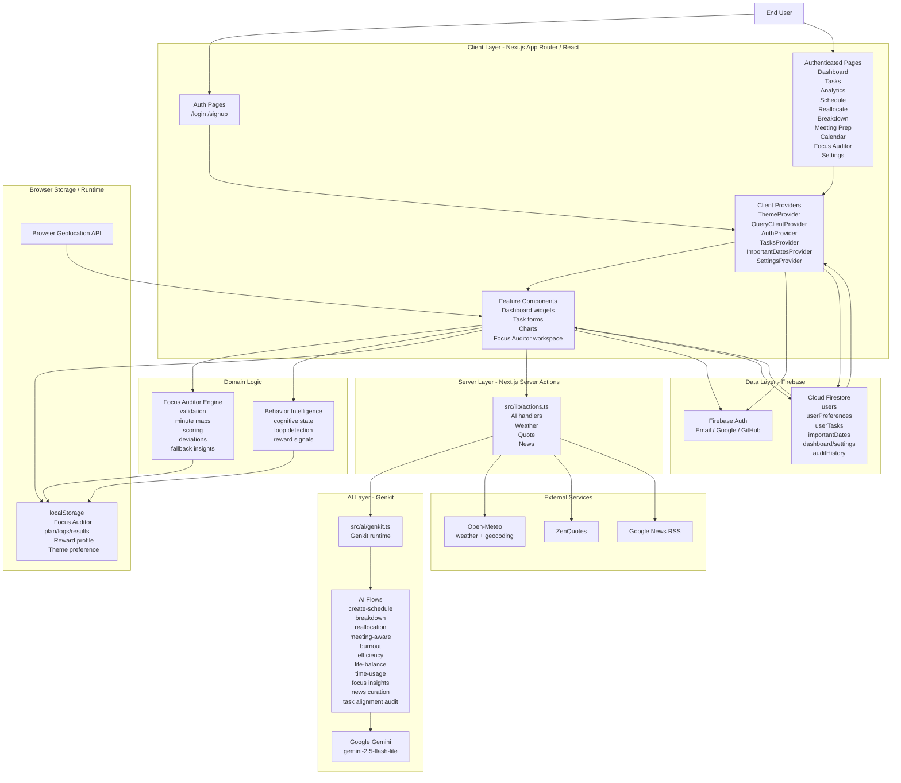

# FocusWeave System Architecture

This diagram reflects the current implementation in the repository.

## Main Data Flows

1. Users interact with Next.js pages and client components.
2. React providers manage auth, task state, settings, and important dates.
3. Firebase Auth authenticates users; Firestore persists user profile, tasks, settings, dates, and audit history.
4. Server actions broker AI requests and external data fetches.
5. Genkit flows call Gemini for planning, analytics, and audit-style features.
6. The Focus Auditor also performs local scoring and behavior analysis in-browser, with localStorage used for fast persistence and Firestore used for history sync.
